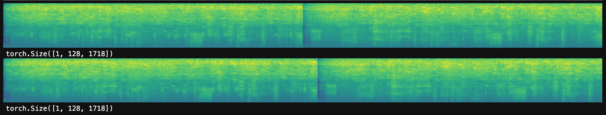
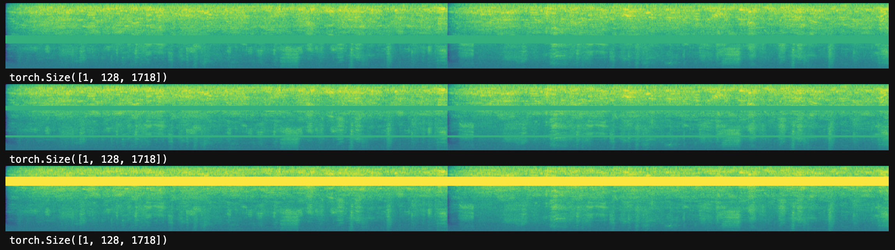
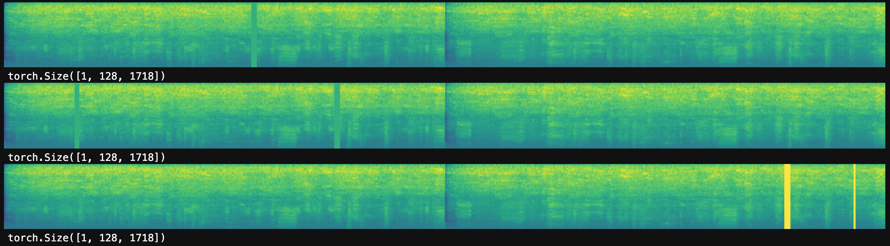
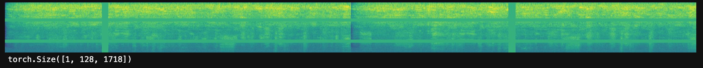

<div align="center">
  <br>
  <h1>🎙️ SpecArgs</h1>
  <h3>SpecAugment-enhanced Whisper Fine-Tuning for Automatic Speech Recognition</h3>
  <br>

  
  
  
  
  

  <br>

  <p align="center">
    <b>Fine-tune</b> · <b>Augment</b> · <b>Recognize</b>
  </p>

  <p>
    A modular speech recognition pipeline that fine-tunes OpenAI Whisper models with <b>SpecAugment</b> data augmentation — time warping, frequency masking, and time masking — wrapped in a sleek desktop GUI.
  </p>

  <br>
</div>

---

## 📋 Table of Contents

- [Overview](#-overview)
- [Features](#-features)
- [Architecture](#-architecture)
- [Getting Started](#-getting-started)
  - [Prerequisites](#prerequisites)
  - [Installation](#installation)
- [Usage](#-usage)
  - [Generate Synthetic Data](#1-generate-synthetic-data)
  - [Train / Fine-tune](#2-train--fine-tune)
  - [Launch GUI](#3-launch-gui)
  - [Evaluate](#4-evaluate)
- [Project Structure](#-project-structure)
- [SpecAugment Pipeline](#-specaugment-pipeline)
- [Results](#-results)
- [Built With](#-built-with)
- [Team](#-team)
- [License](#-license)

---

## 📖 Overview

**SpecArgs** (Spectral Augmentation Arguments) is a university research project that explores how **SpecAugment** — a simple yet powerful spectrogram augmentation technique — can improve the robustness of OpenAI's Whisper ASR models.

The project implements the full lifecycle:

| Stage | Description |
|-------|-------------|
| **Data Generation** | Synthesize speech datasets via Google TTS |
| **Augmentation** | Apply time warping, frequency & time masking to mel spectrograms |
| **Fine-Tuning** | Fine-tune Whisper (tiny.en → small.en) with augmented data |
| **Inference** | Real-time transcription via a modern dark-theme GUI |
| **Evaluation** | WER & accuracy benchmarks before/after fine-tuning |

---

## ✨ Features

- **🎛️ SpecAugment On-the-Fly** — Frequency masking (`F=20`, 2 masks), time masking (`T=40`, 2 masks), and sparse-image time warping applied at configurable probability during training
- **🧠 Multi-Model Support** — Whisper `tiny.en`, `base.en`, `small.en`, or any HuggingFace-compatible fine-tuned model
- **🖥️ Dark-Themed GUI** — Built with `customtkinter`; press record, get transcriptions, and hear them spoken back
- **📊 Before/After Comparison** — Automatic baseline WER measurement before fine-tuning, then comparison after
- **🤖 Synthetic Data Pipeline** — Generate hundreds of labeled WAV+TXT pairs via gTTS with automatic MP3→WAV conversion
- **📈 Checkpointing & Early Stopping** — Training resumes from checkpoints; separate LAS trainer GUI with patience-based early stopping
- **🖼️ Visualization** — Augmented spectrogram images saved to `img/` for paper/report figures

---

## 🏗️ Architecture

```
┌─────────────┐    ┌──────────────────┐    ┌─────────────────┐
│  Generate    │───▶│  Whisper Model   │───▶│  SpecAugment    │
│  Synthetic   │    │  (tiny/base/     │    │  Collator       │
│  Data (TTS)  │    │   small.en)      │    │  (on-the-fly)   │
└─────────────┘    └──────────────────┘    └─────────────────┘
                            │                       │
                            ▼                       ▼
                    ┌──────────────────────────────────────┐
                    │       🤗 Seq2SeqTrainer              │
                    │  Fine-Tune → Checkpoint → Save       │
                    └──────────────────────────────────────┘
                            │
                            ▼
                    ┌──────────────────────┐
                    │   Speech App (GUI)   │
                    │  customtkinter  🎤   │
                    └──────────────────────┘
```

> 📎 See [`Diagrams/Architecture.pdf`](./Diagrams/Architecture.pdf) and [`Diagrams/Flow Diagram.pdf`](./Diagrams/Flow%20Diagram.pdf) for detailed diagrams.

---

## 🚀 Getting Started

### Prerequisites

- **Python 3.10+**
- **FFmpeg** (for MP3→WAV conversion in data generation)

### Installation

```bash
# Clone the repository
git clone https://github.com/your-username/specArgs.git
cd specArgs

# Install dependencies
pip install -r requirements.txt

# (Optional) System dependencies for audio on Linux
# See setup.sh for details
```

---

## 🎯 Usage

### 1. Generate Synthetic Data

```bash
python generate_data.py
```

Creates 250 WAV+TXT pairs in `./data/` using Google TTS.

### 2. Train / Fine-tune

```bash
# Fine-tune Whisper small.en on custom data
python train_on_data.py --model small.en --epochs 10 --batch 4

# Or use the LAS Trainer GUI (alternative model)
python train_gui.py
```

### 3. Launch GUI

```bash
# With a pretrained Whisper model
python speech_app.py

# With a fine-tuned model
python speech_app.py --model ./finetuned_model
```

### 4. Evaluate

```bash
# Evaluate fine-tuned Whisper on test split
python test_model.py --model ./finetuned_model

# Evaluate LAS checkpoint accuracy
python evaluate_accuracy.py
```

---

## 📁 Project Structure

```
specArgs/
├── speech_app.py              # 🖥️  GUI application entry point
├── train_on_data.py           # 🧠  Whisper fine-tuning entry point
├── train_gui.py               # 🎛️  LAS trainer with EarlyStopping GUI
├── test_model.py              # 📊  Evaluate fine-tuned model
├── evaluate_accuracy.py       # 📐  Evaluate LAS checkpoint
├── generate_data.py           # 🤖  Synthetic data via gTTS
│
├── member_1/                  # 🔊  Audio utilities
│   ├── audio_utils.py         #     Load audio → mel spectrogram
│
├── member_2/                  # 🌊  Sparse image warping
│   ├── sparse_image_warp.py   #     Thin-plate spline warp
│
├── member_3/                  # 🎛️  SpecAugment
│   ├── time_warp.py           #     Time warping routine
│   ├── masking.py             #     freq_mask & time_mask
│
├── member_4/                  # 🧠  Training & Inference
│   ├── tts.py                 #     Text-to-Speech
│   ├── training/
│   │   ├── trainer.py         #     Seq2SeqTrainer setup
│   │   ├── dataset.py         #     Dataset preparation
│   │   ├── collator.py        #     SpecAugment data collator
│   │   └── metrics.py         #     WER computation
│   ├── inference/
│   │   └── predict.py         #     Model evaluation
│   └── utils/
│       ├── audio.py           #     Audio preprocessing
│       ├── device.py          #     CUDA/CPU detection
│       └── paths.py           #     Default paths
│
├── member_5/                  # 🖥️  GUI & Pipeline
│   ├── pipeline.py            #     Full SpecAugment pipeline
│   ├── visualization.py       #     Benchmark timing plots
│   └── gui/
│       ├── app.py             #     SpeechApp main class
│       └── components.py      #     Constants & settings
│
├── img/                       # 🖼️  SpecAugment visualizations
├── Diagrams/                  # 📐  Architecture PDFs
├── requirements.txt           # 📦  Dependencies
└── setup.sh                   # ⚙️  Linux/Mac setup
```

---

## 🎛️ SpecAugment Pipeline

The core augmentation pipeline applies three transformations to mel spectrograms during training:

| Transformation | Parameter | Description |
|----------------|-----------|-------------|
| **Time Warping** | `W` (time steps) | Warps the spectrogram along the time axis using sparse image warping (thin-plate spline interpolation) |
| **Frequency Masking** | `F=20`, `num_masks=2` | Masks random contiguous frequency bins by replacing them with the mean value |
| **Time Masking** | `T=40`, `num_masks=2` | Masks random contiguous time steps |

> Applied with **80% probability** during training (`specaug_prob=0.8`).

### Augmentation Examples

| Original | Time Warp | Freq Mask | Time Mask | Combined |
|:--------:|:---------:|:---------:|:---------:|:--------:|
| (see `img/`) |  |  |  |  |

---

## 📊 Results

The trainer automatically reports **Word Error Rate (WER)** and **Word Accuracy** before and after fine-tuning:

```
[Before] WER: 12.34%  |  Word Accuracy: 87.66%
[After]  WER:  8.90%  |  Word Accuracy: 91.10%
Improvement: 27.9% error reduction
```

---

## 🛠️ Built With

| Library | Purpose |
|---------|---------|
| [openai-whisper](https://github.com/openai/whisper) | Pretrained ASR models |
| [transformers](https://github.com/huggingface/transformers) | Whisper model loading & Seq2SeqTrainer |
| [PyTorch](https://pytorch.org/) | Deep learning framework |
| [torchaudio](https://pytorch.org/audio/) | Audio I/O & spectrogram transforms |
| [librosa](https://librosa.org/) | Audio preprocessing |
| [customtkinter](https://github.com/TomSchimansky/CustomTkinter) | Modern dark-theme GUI |
| [datasets](https://github.com/huggingface/datasets) | Dataset management |
| [evaluate](https://github.com/huggingface/evaluate) | WER metric |
| [sounddevice](https://python-sounddevice.readthedocs.io/) | Microphone recording |
| [gTTS](https://github.com/pndurette/gTTS) | Text-to-Speech data generation |

---

## 👥 Team

University project by:

| Member | Responsibility |
|--------|---------------|
| **Member 1** | Audio loading & mel spectrogram conversion |
| **Member 2** | Sparse image warping algorithm |
| **Member 3** | SpecAugment augmentation functions |
| **Member 4** | Training pipeline, inference, TTS, utilities |
| **Member 5** | GUI application & pipeline orchestration |

---

## 📄 License

This project is licensed under the MIT License — see the [LICENSE](LICENSE) file for details.

---

<div align="center">
  <sub>Built with ❤️ for speech recognition research</sub>
</div>
